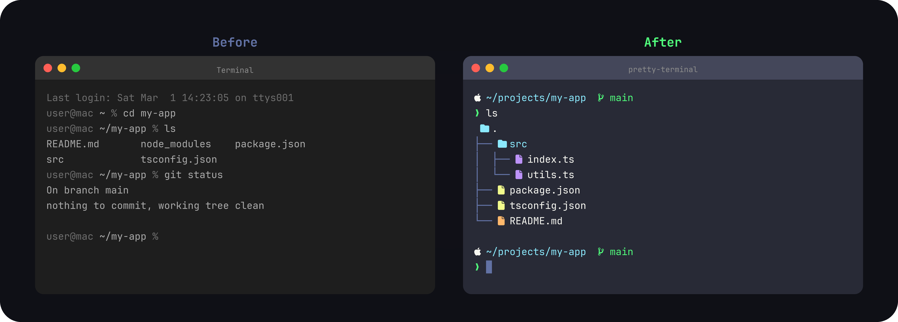

# my-nvim-settings

Neovim config with installer-driven setup and deterministic post-install verification.

## Media




## Quick Look

- Uses a single canonical config root at this repository root (`init.lua`, `lua/`, `plugin/`).
- Task 2 drift-check command: `test -f init.lua && test ! -f nvim/init.lua`.
- Supports macOS/Linux and Windows (native PowerShell).
- Installers are idempotent and emit `INSTALLED` / `SKIPPED` / `FAILED` status lines.
- Post-install validation command is:
  `nvim --headless "+Lazy! sync" "+checkhealth" +qa`.
- Default GUI font target is `D2CodingLigature Nerd Font Mono` (fallback: `D2CodingLigature Nerd Font`).

### Using an LLM (Recommended)

For one-shot, copy/paste onboarding, use `PROMPT.md`.
It includes platform-specific branches for macOS/Linux and Windows and explicit completion checks.

## Manual fallback

### Prerequisites

- `git`
- `nvim` (Neovim 0.11 or newer recommended)

### macOS / Linux

```bash
git clone https://github.com/wjgoarxiv/my-nvim-settings.git ~/my-nvim-settings
cd ~/my-nvim-settings
bash ./install.sh --yes --ci
```

### Windows (native PowerShell)

```powershell
git clone https://github.com/wjgoarxiv/my-nvim-settings.git "$env:USERPROFILE\my-nvim-settings"
Set-Location "$env:USERPROFILE\my-nvim-settings"
pwsh -File .\install.ps1 -Yes -CI
```

## Options

- `bash ./install.sh --yes --ci`
  - `--yes` : auto-confirm for scripts that default to interactive
  - `--ci` : CI mode logging/output behavior
- `pwsh -File .\install.ps1 -Yes -CI`
  - `-Yes` : auto-confirm
  - `-CI` : CI mode logging/output behavior

## Rerun semantics and backup policy

Installers are safe to rerun.

- If config target already points to this repo, status is `SKIPPED` and no replacement happens.
- If target exists but is different, it is moved to `nvim-backups` before linking:

  - Unix target: `~/.config/nvim` backup `~/.config/nvim-backups/nvim.YYYYMMDDHHMMSS`
  - Windows target: `$env:LOCALAPPDATA\nvim` backup under `${parent}\nvim-backups`

- Stage-level status labels are always `INSTALLED`, `SKIPPED`, or `FAILED`.

## Post-install outputs

Capture installer output and validate both conditions.

```bash
bash ./install.sh --yes --ci | tee /tmp/my-nvim-settings-install.log
```

```powershell
pwsh -File .\install.ps1 -Yes -CI | Tee-Object -FilePath "$env:TEMP\my-nvim-settings-install.log"
```

Check for:

- no `FAILED` lines
- `Post-install headless validation succeeded: nvim --headless "+Lazy! sync" "+checkhealth" +qa`

If needed, run the same command manually:

```bash
nvim --headless "+Lazy! sync" "+checkhealth" +qa
```

## Troubleshooting

- `Dependency available: ...` lines should show for `git` and `nvim`; install missing dependencies and rerun.
- If path replacement is unexpected, check `nvim-backups` and restore previous config from the timestamped backup.
- If installer exits non-zero, read the last `FAILED` line and fix dependency/path/deployment issue.
- If icon/Korean glyphs look broken in GUI clients, install/select `D2CodingLigature Nerd Font Mono` (or fallback `D2CodingLigature Nerd Font`) in the terminal/GUI font settings.

## Canonical repository structure

```text
├── init.lua
├── lua
│   └── wjgoarxiv
│       ├── core
│       │   ├── colorscheme.lua
│       │   ├── keymaps.lua
│       │   └── options.lua
│       ├── plugins
│       │   ├── lsp
│       │   │   ├── lspconfig.lua
│       │   │   ├── lspsaga.lua
│       │   │   ├── mason.lua
│       │   │   └── null-ls.lua
│       │   ├── lualine.lua
│       │   ├── nvim-cmp.lua
│       │   ├── nvim-tree.lua
│       │   ├── telescope.lua
│       │   ├── toggleterm.lua
│       │   └── treesitter.lua
│       └── plugins-setup.lua
└── plugin
```

## Notes

- See `install.sh` / `install.ps1` for exact behavior on each OS.
