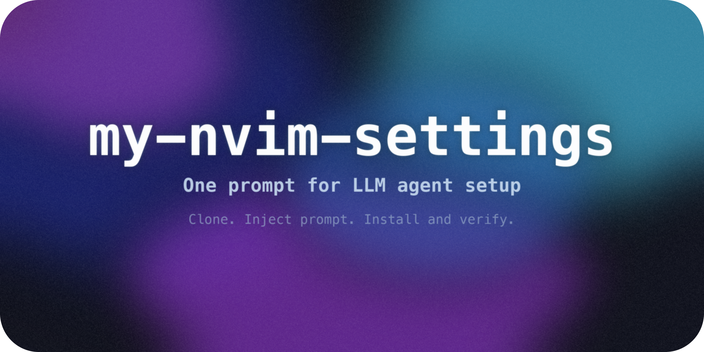

<a id="top"></a>

<p align="center">
  
</p>

<h1 align="center">my-nvim-settings</h1>

<p align="center">
  <em>Set up a full Neovim config with one prompt for your LLM agent.</em>
</p>

<p align="center">
  <a href="#quick-start"><b>Quick Start</b></a> ·
  <a href="#features">Features</a> ·
  <a href="#manual-install">Manual Install</a> ·
  <a href="#apple-silicon">Apple Silicon</a> ·
  <a href="#image-preview">Image Preview</a> ·
  <a href="#troubleshooting">Troubleshooting</a>
</p>

<p align="center">
  <a href="https://github.com/wjgoarxiv/my-nvim-settings"></a>
  <a href="./LICENSE"></a>
  
  
  
  
</p>

---

> [!NOTE]
> A cross-platform Neovim config with a one-prompt onboarding flow for LLM agents. Clone, inject the prompt, install, and verify -- safe to rerun, deterministic health checks, backup-on-replace logic built in.

> [!IMPORTANT]
> **Apple Silicon Macs always get a native arm64 setup, never x86_64.** The installer re-launches itself natively if your terminal runs under Rosetta, rebuilds leftover x86_64 plugin builds, and stops if `nvim` itself is x86_64-only. Details in [Apple Silicon](#apple-silicon).

<a id="features"></a>

## ✨ Features

| Feature | What you get |
|---------|--------------|
| 🤖 **One-Prompt Onboarding** | Copy-paste a single block into your LLM agent to install end-to-end |
| 🌍 **Cross-Platform** | macOS, Linux, and Windows installers with platform-specific handling |
| 🍎 **Native on Apple Silicon** | Runs as arm64 even when started from a Rosetta terminal; no x86_64 plugin builds |
| 🔒 **Lazy.nvim Plugin Setup** | Deterministic, locked plugin versions via `lazy-lock.json` |
| 🗂️ **Yazi File Navigation** | Open [yazi](https://github.com/sxyazi/yazi) from the current file's folder with `<C-\>` |
| 🌗 **Light / Dark Theme Preference** | Tokyonight Night or Day, picked with `:Theme light\|dark\|auto` and remembered across restarts |
| 🖼️ **Inline Image Preview** | View images directly in Neovim via [snacks.nvim](https://github.com/folke/snacks.nvim) (Kitty Graphics Protocol) |
| ♻️ **Safe Rerun** | Existing configs are backed up before relinking; idempotent installers |
| ✅ **Post-Install Validation** | Headless health check catches issues before you open Neovim |

<a id="quick-start"></a>

## 🚀 Quick Start

> [!TIP]
> Works with any LLM CLI agent (Claude Code, Codex, Gemini CLI). Just paste the block below into your chat.

```text
Clone (or update) this repository and install it end-to-end.
IMPORTANT: Never delete or overwrite existing files without backing them up first.

0) macOS on Apple Silicon only - stay native (arm64), never x86_64:
   - Run: uname -m   (it must print arm64)
   - If it prints x86_64, the terminal is running under Rosetta. Open a native
     terminal, or prefix every command below with: arch -arm64
   - Use only /opt/homebrew/bin/brew, never /usr/local/bin/brew.

1) Clone or update:
   - macOS/Linux:
     If ~/my-nvim-settings does not exist:
       git clone https://github.com/wjgoarxiv/my-nvim-settings.git ~/my-nvim-settings
     If ~/my-nvim-settings already exists:
       cd ~/my-nvim-settings && git pull
   - Windows PowerShell:
     If "$env:USERPROFILE\my-nvim-settings" does not exist:
       git clone https://github.com/wjgoarxiv/my-nvim-settings.git "$env:USERPROFILE\my-nvim-settings"
     If "$env:USERPROFILE\my-nvim-settings" already exists:
       Set-Location "$env:USERPROFILE\my-nvim-settings"; git pull

2) Install optional runtime tools (skip ones already installed):
   - macOS: brew install imagemagick yazi
   - Ubuntu/Debian: sudo apt install imagemagick yazi
   - Windows PowerShell: choco install imagemagick; winget install sxyazi.yazi
   - Windows MSYS2 UCRT64 zsh: pacman -S mingw-w64-ucrt-x86_64-yazi

3) Run installer by OS:
   - macOS/Linux:
     cd ~/my-nvim-settings
     bash ./install.sh --yes --ci
   - Windows PowerShell:
     Set-Location "$env:USERPROFILE\my-nvim-settings"
     pwsh -File .\install.ps1 -Yes -CI
   Note: the installer backs up any existing nvim config before relinking.
   It is safe to rerun.

4) Verify:
   nvim --headless "+Lazy! sync" "+checkhealth" +qa

5) Return:
   - whether install passed
   - the last 30 log lines
   - any FAILED markers
```

<a id="manual-install"></a>

## 🛠️ Manual Install

### macOS / Linux

```bash
git clone https://github.com/wjgoarxiv/my-nvim-settings.git ~/my-nvim-settings
cd ~/my-nvim-settings
bash ./install.sh --yes --ci
```

On Apple Silicon this installs natively as arm64 -- see [Apple Silicon](#apple-silicon).

### Windows (PowerShell)

```powershell
git clone https://github.com/wjgoarxiv/my-nvim-settings.git "$env:USERPROFILE\my-nvim-settings"
Set-Location "$env:USERPROFILE\my-nvim-settings"
pwsh -File .\install.ps1 -Yes -CI
```

> [!WARNING]
> **Windows notes:**
> - **Image preview** requires Windows Terminal v1.22+ (Kitty Graphics Protocol). Verify with `wt --version`.
> - `telescope-fzf-native` needs build tools: `choco install -y cmake mingw`
> - If telescope reports fzf load failure, build manually:
>   ```
>   cd "$env:LOCALAPPDATA\nvim-data\lazy\telescope-fzf-native.nvim"
>   cmake -S . -B build -G "MinGW Makefiles"
>   cmake --build build --config Release
>   ```

<a id="apple-silicon"></a>

## 🍎 Apple Silicon

On an Apple Silicon Mac the installer never sets up x86_64 binaries. Mixing the two architectures is what breaks Neovim: an arm64 `nvim` cannot load an x86_64 `libfzf.so`, which shows up as an `incompatible architecture` error at startup.

| Situation | What `install.sh` does |
|-----------|------------------------|
| Started from a Rosetta (x86_64) terminal | Re-launches itself with `arch -arm64`, so plugin builds and downloaded tools are arm64 |
| Plugin build left over from an x86_64 install (e.g. `telescope-fzf-native`'s `libfzf.so`) | Rebuilds it natively, or stops with `FAILED` if it cannot |
| `nvim` is an x86_64-only binary | Stops and asks for a native build |
| Linux, Intel Macs, Windows | Nothing changes |

Check your terminal first:

```bash
uname -m   # must print arm64
```

If it prints `x86_64`, open a native terminal (for example, turn off *Open using Rosetta* in the terminal app's Get Info panel) and use the Homebrew in `/opt/homebrew`, not the Intel one in `/usr/local`.

<details>
<summary>Already installed under Rosetta? Fix leftovers by hand</summary>

The installer repairs `lazy.nvim` plugin builds on its own. Other tools downloaded earlier stay x86_64 until you reinstall them:

```bash
# telescope-fzf-native (also done automatically by install.sh)
cd ~/.local/share/nvim/lazy/telescope-fzf-native.nvim && make clean && make
file build/libfzf.so   # should say arm64
```

Inside Neovim:

- `:TSInstall! <language>` reinstalls a treesitter parser that was compiled for x86_64
- `:MasonInstall --force <package>` reinstalls a Mason tool

</details>

<a id="how-it-works"></a>

## ⚙️ How It Works

<details>
<summary>Show the install pipeline</summary>

```
                  my-nvim-settings pipeline
                  ~~~~~~~~~~~~~~~~~~~~~~~~

 [LLM Agent / User]
       |
       v
 +-------------------+
 | 1. CLONE          |     git clone / git pull
 |   - fetch repo    |     safe idempotent update
 +-------------------+
       |
       v
 +-------------------+
 | 2. INSTALL        |     install.sh / install.ps1
 |   - backup old    |     backup-on-replace logic
 |   - symlink new   |     platform detection
 |   - sync plugins  |     lazy.nvim + lazy-lock.json
 +-------------------+
       |
       v
 +-------------------+
 | 3. VERIFY         |     nvim --headless
 |   - health check  |     checkhealth + Lazy sync
 |   - report status |     PASSED / FAILED markers
 +-------------------+
```

</details>

<a id="image-preview"></a>

## 🖼️ Image Preview

This config includes [snacks.nvim](https://github.com/folke/snacks.nvim) image module for inline image previews (PNG, JPG, GIF, WebP, PDF, etc.) directly inside Neovim.

| OS | Terminal | Install ImageMagick |
|----|----------|---------------------|
| macOS | Ghostty | `brew install imagemagick` |
| macOS | Kitty | `brew install imagemagick` |
| Windows | Windows Terminal v1.22+ | `choco install imagemagick` |
| Linux | Ghostty / Kitty | `sudo apt install imagemagick` |

The terminal is auto-detected. For tmux users, add to `~/.tmux.conf`:

```tmux
set -gq allow-passthrough on
set -g visual-activity off
set -g focus-events on
```

## 🗂️ Yazi File Navigation

This config maps `<C-\>` to [yazi.nvim](https://github.com/mikavilpas/yazi.nvim), opening yazi in a floating window at the current file's directory. Press `<C-\>` again inside the yazi popup to close it. `nvim-tree` (`<leader>e`) and Telescope (`<leader>ff`, `<leader>fs`, etc.) remain unchanged.

Install the yazi binary before using the shortcut:

| OS | Install yazi |
|----|--------------|
| macOS | `brew install yazi` |
| Linux | `sudo apt install yazi` or your distro package manager |
| Windows PowerShell | `winget install sxyazi.yazi` |
| Windows MSYS2 UCRT64 zsh | `pacman -S mingw-w64-ucrt-x86_64-yazi` |

Inside yazi, `<Enter>` enters a hovered directory or opens a hovered file via the bundled `smart-enter` plugin. The bundled yazi config also applies a Tokyo Night flavor, shows Git status via `git.yazi`, and maps `T` / `~` to hide or maximize the preview pane. When yazi closes, the nvim-tree root follows yazi's last directory.

<details>
<summary>Standalone yazi: optional cd-on-quit helper</summary>

For standalone terminal yazi, the repo includes an optional cd-on-quit helper. It is not installed automatically; source it manually from your shell rc if you want `y` to leave your shell in yazi's last directory:

```bash
source ~/.config/nvim/yazi/yazi-cd.sh
```

The helper uses `~/.config/nvim/yazi` as `YAZI_CONFIG_HOME` when that directory exists, so standalone `y` gets the same Tokyo Night, Git status, and pane-toggle setup as yazi.nvim. Plain `yazi` still uses Yazi's default `~/.config/yazi` unless you set `YAZI_CONFIG_HOME` yourself:

```bash
YAZI_CONFIG_HOME=~/.config/nvim/yazi yazi --debug
```

The helper only affects standalone shell sessions. It does not change Neovim's cwd and does not alter the `<C-\>` yazi.nvim workflow.

</details>

After installation, run `:Lazy load yazi.nvim` and then `:checkhealth yazi` inside Neovim if the shortcut does not open yazi.

## 🌗 Theme (Light / Dark)

The colorscheme is [tokyonight.nvim](https://github.com/folke/tokyonight.nvim): `tokyonight-night` for dark and `tokyonight-day` for light. Pick the one you prefer from inside Neovim:

| Command | Effect |
|---------|--------|
| `:Theme light` | Use Tokyonight Day and remember it |
| `:Theme dark` | Use Tokyonight Night and remember it |
| `:Theme auto` | Follow the system appearance (default) |
| `<leader>tt` | Toggle between light and dark |

The choice is stored as a single word in `stdpath("state")/wjgoarxiv-theme` (`~/.local/state/nvim/wjgoarxiv-theme` on macOS/Linux), never inside this repo. An explicit `light` or `dark` wins over any automatic detection; `auto` reads the macOS appearance setting (`defaults read -g AppleInterfaceStyle`); on other platforms it leaves Neovim's own `background` value untouched, so the variant follows whatever Neovim detected.

The lualine statusline follows the active variant, and the bundled yazi config ships a matching `tokyo-day` flavor for light terminals. Terminal emulators and tmux keep their own themes; this setting only affects Neovim.

## 📋 Requirements

| Dependency | Required | Purpose |
|-----------|----------|---------|
| `git` | Yes | Clone repository |
| `nvim` 0.11+ | Yes | Runtime (arm64 build on Apple Silicon) |
| `yazi` | No (recommended) | Floating TUI file navigation with `<C-\>` |
| `imagemagick` | No (recommended) | Inline image preview |

## 🔤 Font (Korean + Icons)

Recommended: **D2CodingLigature Nerd Font Mono** (fallback: `D2CodingLigature Nerd Font`)

```powershell
# Windows (Chocolatey)
choco install -y nerd-fonts-D2Coding
```

## 🎛️ Installer Options

| Flag | Unix | Windows | Effect |
|------|------|---------|--------|
| Auto-confirm | `--yes` | `-Yes` | Skip confirmation prompts |
| CI mode | `--ci` | `-CI` | Machine-readable log output |

<a id="troubleshooting"></a>

## 🩺 Troubleshooting

| Problem | Solution |
|---------|----------|
| `incompatible architecture` / `fzf extension doesn't exist` at startup (Apple Silicon) | Rerun `bash ./install.sh --yes --ci` from a native arm64 terminal; see [Apple Silicon](#apple-silicon) |
| Missing dependency | Install `git` or `nvim`, then rerun |
| Installer failed | Check the last `FAILED` line in output |
| Wrong path linked | Restore from `nvim-backups` and rerun |
| Plugin issues | `nvim --headless "+Lazy! sync" "+checkhealth" +qa` |
| `<C-\>` does not open yazi | Install `yazi`, then run `:Lazy load yazi.nvim` followed by `:checkhealth yazi` |
| Theme flips back after start | Pin it with `:Theme dark` or `:Theme light`; `:Theme auto` re-enables detection |
| Image not showing (macOS/Linux) | Install `imagemagick`, use Ghostty or Kitty, run `:checkhealth snacks` |
| Image not showing (Windows) | `choco install imagemagick` + Windows Terminal v1.22+ |
| `nvim-tree obj is nil` | Open Neovim inside a git repo; usually non-fatal |

## 🤝 Contributing

Contributions are welcome! Please:

1. Fork the repository
2. Create a feature branch (`git checkout -b feature/my-feature`)
3. Commit your changes
4. Open a Pull Request

For bug reports or feature requests, please [open an issue](https://github.com/wjgoarxiv/my-nvim-settings/issues).

## 📄 License

This project is licensed under the [MIT License](./LICENSE).

---

<p align="center">
  <a href="#top">Back to top</a> ·
  <a href="#quick-start">Quick Start</a> ·
  <a href="#troubleshooting">Troubleshooting</a> ·
  <a href="https://github.com/wjgoarxiv/my-nvim-settings/issues">Issues</a> ·
  <a href="./LICENSE">License</a>
</p>
